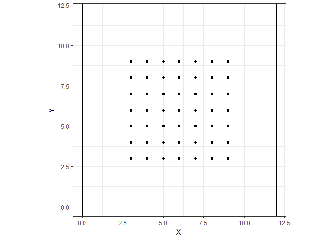

There are a few steps involved in simulating occupancy & SCR data, outlined below:

* Defining the state space
* Simulating activity centers from the defined state space
* Defining the expected *use* of space by each activity center, based on a function of space
* Simulating *use* based on the expectation, in a Poisson random fashion
* Thinning *use* by a certain amount and removing individual ID to obtain occupancy data
* Thinning occupancy information by a certain amount and compressing to presence absence *of individuals* at a trap on an occasion to obtain SCR data

We demonstrate each of these in the document below.

# Simulation of activity centers

Animal activity centers are simulated to be uniformly distributed across <a href="https://www.codecogs.com/eqnedit.php?latex=\mathcal{S}" target="_blank"></a>, which is the state space of all possible locations for the animal activity centers that could have generated the data. 


## Definition of the state space 

Right after the seed is referenced, there is a section creating this state space. 


```r
# Define the state-space by buffering the traps
xmin<- min(X[,1])-buff
xmax<- max(X[,1])+buff
ymin<- min(X[,2])-buff
ymax<- max(X[,2])+buff
```

You will notice that this portion of the script is dependent upon `X`, which is the object holding the locations for the traps, `buff`, which is a buffer around those locations in `X`. What does this look like? Well, say that the traps are just oriented in a regular fashion somewhere near the origin, like so:


<!-- -->

The horizontal and vertical lines are the boundaries of this state space 
<a href="https://www.codecogs.com/eqnedit.php?latex=\mathcal{S}" target="_blank"></a>. 
By setting these boundaries, we basically state that any animal activity centers *outside* of 
<a href="https://www.codecogs.com/eqnedit.php?latex=\mathcal{S}" target="_blank"></a> 
do not have an appreciable probability of being detected *within* 
<a href="https://www.codecogs.com/eqnedit.php?latex=\mathcal{S}" target="_blank"></a>. 
It is necessary to specify a state space that is large enough to make this assumption hold true; we usually do this by specifying a buffer around the traps, defined by the `buff` object. If 
<a href="https://www.codecogs.com/eqnedit.php?latex=\sigma" target="_blank"></a> 
is the "range" of an animal's activity center, then we usually take a buffer larger than this - in our case, we have selected 
<a href="https://www.codecogs.com/eqnedit.php?latex=3\sigma" target="_blank"></a>. 
