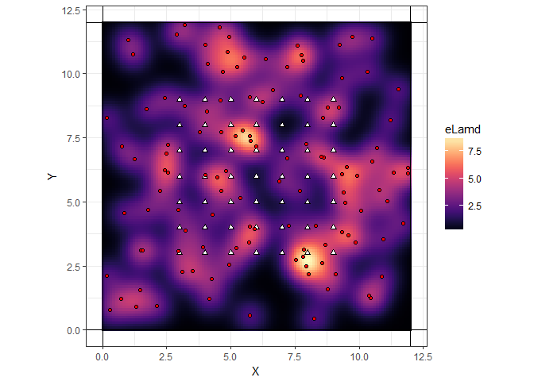
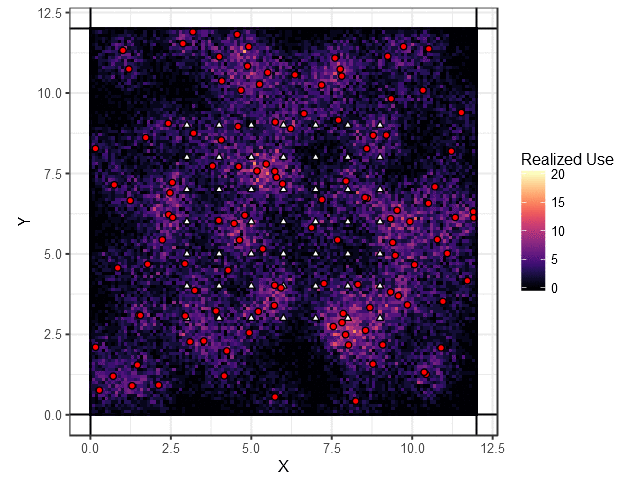

There are a few steps involved in simulating occupancy & SCR data, outlined below:

* Defining the state space
* Simulating activity centers from the defined state space
* Defining the expected *use* of space by each activity center, based on a function of space
* Simulating *use* based on the expectation, in a Poisson random fashion
* Thinning *use* by a certain amount and removing individual ID to obtain occupancy data
* Thinning occupancy information by a certain amount and compressing to presence absence *of individuals* at a trap on an occasion to obtain SCR data

We demonstrate each of these in the document below.

# Population simulation

Animal activity centers are simulated to be uniformly distributed across <a href="https://www.codecogs.com/eqnedit.php?latex=\mathcal{S}" target="_blank"></a>, which is the state space of all possible locations for the animal activity centers that could have generated the data. 


## Definition of the state space 

Right after the seed is referenced, there is a section creating this state space. 


```r
# Define the state-space by buffering the traps
xmin<- min(X[,1])-buff
xmax<- max(X[,1])+buff
ymin<- min(X[,2])-buff
ymax<- max(X[,2])+buff
Xgrid<- expand.grid(seq(xmin,xmax,grid.space), seq(ymin,ymax,grid.space))
```

(note: for some other purposes elaborated below we are generating a fine grid within the state space called `Xgrid`. They are points separated each by `grid.space`, which is set here to 0.5 units of distance. For comparison, the grids are each separated by 1 unit)

You will notice that this portion of the script is dependent upon `X`, which is the object holding the locations for the traps, `buff`, which is a buffer around those locations in `X`. What does this look like? Well, say that the traps are just oriented in a regular fashion somewhere near the origin, like so:


The horizontal and vertical lines are the boundaries of this state space 
<a href="https://www.codecogs.com/eqnedit.php?latex=\mathcal{S}" target="_blank"></a>. 
By setting these boundaries, we basically state that any animal activity centers *outside* of 
<a href="https://www.codecogs.com/eqnedit.php?latex=\mathcal{S}" target="_blank"></a> 
do not have an appreciable probability of being detected *within* 
<a href="https://www.codecogs.com/eqnedit.php?latex=\mathcal{S}" target="_blank"></a>. 
It is necessary to specify a state space that is large enough to make this assumption hold true; we usually do this by specifying a buffer around the traps, defined by the `buff` object. If 
<a href="https://www.codecogs.com/eqnedit.php?latex=\sigma" target="_blank"></a> 
is the "range" of an animal's activity center, then we usually take a buffer larger than this - in our case, we have selected 
<a href="https://www.codecogs.com/eqnedit.php?latex=3\sigma" target="_blank"></a>. 

Note that the state space can easily be *larger* than this, but after a while it just adds unnecessary computation (animals 10 sigma away surely won't be captured, ever). 

## Simulating the activity centers

Once the state space has been defined, it is simple to simulate uniformly distributed animals. We conventionally use the `runif()` function to draw random uniform variates.


```r
set.seed(1)
s = cbind(
  runif(N, min(X[,1])-buff, max(X[,1])+buff), 
  runif(N, min(X[,2])-buff, max(X[,2])+buff)
  )

s = data.frame(x = s[,1], y = s[,2])
```

I've broken up the lines so you might see what commands do what. First, we specify `N = 120`, saying we want 120 activity centers in the region. Then we `cbind` two things: 

* Random uniform selection of x positions
* Random uniform selection of y positions. 

`runif()` takes three arguments; the first is the number of random draws we want (N), the second is the lower limit of the range, and the third is the upper limit of the range. We specify the lower limit to be the minimum of the `X` (traps) minus the buffer, and the upper limit is the maximum of the traps plus a buffer, in both the x (indexed by `X[,1]`) and y (indexed by `X[,2]`)

Now that we've run that, let's take a look at those positions.


I've made the activity centers in `s` x's. That's it! We have simulated the animal activity centers. Do note that this is *not* the positions of the animals themselves, just the point at which they are most likely to be found. 

# Simulating data

## Computing the distance matrix between `s` and `X`. 

The distance between each element of `s` and `X` tells us about the probability that an animal will be captured. The basic assumption is that animal activity centers that are located closer to traps are more likely to be captured than animals with activity centers further away. Conversely, animals with a *lot* of captures in a particular set of traps relative to other traps *probably* have activity centers close to those traps - this is the basis for the estimation of `s`, `sigma`, and `p_0`, we try to find the values of these that make the most sense given what we have observed. 


(Note: I have taken some liberty expanding the distance matrix into two matrices, for clarity)

Above, I calculate distances between the activity centers and traps (`X`), and the activity centers and the fine grid (`Xgrid`), respectively.

## `e2dist()`

The function `e2dist()` takes two arguments, a set of points on one side, and another set of points on the other. It finds pairwise distances, such that the output is a matrix with rows equal to the rows of the first argument, and columns equal to the rows of the second argument. A simple example, we'll find the distance between four points:


```r
# Some example points
examplePoints1 = rbind(c(-1,-1), c(0,0), c(0,1))
examplePoints2 = rbind(c(1,0), c(1,1))

# Make them into a data frame with indication of which set it belongs to
examplePointsdf = rbind.data.frame(
  cbind(examplePoints1, "Set 1"),
  cbind(examplePoints2, "Set 2")
) 

# Rename some columns
colnames(examplePointsdf) = c("x", "y", "Set")

# Plot the points
ggplot(examplePointsdf) + 
  geom_point(aes(x = x, y = y, color = Set)) + 
  coord_equal() + theme_bw()
```

<!-- -->

```r
# Get distances
e2dist(examplePoints1, examplePoints2)
```

```
##          [,1]     [,2]
## [1,] 2.236068 2.828427
## [2,] 1.000000 1.414214
## [3,] 1.414214 1.000000
```


Notice that there are three rows of the output matrix, and two columns; just as there are three rows in `examplePoints1` and two rows in `examplePoints2`. The output just has the distance from the first point in `examplePoints1` to the first point in `examplePoints2` in the `[1,1]` position. The distance from the second point in `examplePoints1` and the first point in `examplePoints2` is in the position `[1,2]`. So on and so forth. NOTE that unlike other distance functions like `dist()`, this does not calculate *all* pairwise distances, meaning that only distance between the first and second sets are calculated. `dist()` would give a triangular matrix with all distances between all points. 

## Simulating use 

Now that we have distances between traps and activity centers, as well as distances between the grid and activity centers, we can do more. 


```r
# use intensity
lamd<- lam0*exp(-D_grid*D_grid/(2*sigma*sigma))
J = nrow(Xgrid)
# Simulate USE history of each pixel according to a Poisson use model
# This is on the GRID, not at the traps.
y.use <-array(0,dim=c(N,J,K))

for(i in 1:N){ # For each individual
  
 for(j in 1:J){ # For each pixel on the grid
   
   for(k in 1:K){ # For each occasion
     
     y.use[i,j,k]=rpois(1,lamd[i,j]) # How many times did individual i use pixel j?
     
   }
 }
}
```

(Note: I've again taken the liberty of splitting up the functions a little bit)

Okay so in the above, we first make a matrix `lamd`, which is the *expected* intensity of use at every pixel on the landscape. What does this look like? 


<!-- -->

In the image above, I've reformatted the traps to be white triangles, and activity centers to be red circles. We can see that expected use is greater where there are a bunch of activity centers clustered close together, and drops off with distance. This makes perfect sense. Note that this is *expectation* in the statistical sense as well as colloquial sense; illustrated are the mean values that we should expect to see in simulation. Since we are simulating Poisson random variables, the variance is equal to the mean. Also, keep in mind that this is `lam.j` used in calculating expected occupancy.

Turning now to the `y.use` that we simulated: we used the *expected* intensity as the mean for the simulation. We use `rpois()`, which takes two arguments -- how many random variables to simulate, and the mean intensity of the Poisson distribution. We plug in the `lamd` into the second argument, and simulate one random outcome per pixel grid. This is how it looks SIMULATED for a bunch of occasions conditional on the activity centers we've already generated. Simulation is a great way to observe the variability in your model that may be difficult to convey with variances and model assumptions. 

In the below plot, the black areas from the expected intensity should nearly always be black, and the bright areas are almost always bright. 





## Estimating total occupancy on the landscape

Given what we have obtained we should be able to say something about total occupancy on the landscape. Conceptually, this is

<a href="https://www.codecogs.com/eqnedit.php?latex=\psi_g&space;&=&space;1&space;-&space;(1-p_g)^K" target="_blank"></a>

<a href="https://www.codecogs.com/eqnedit.php?latex=p_g&space;=&space;1&space;-&space;\exp(\lambda_{g})" target="_blank"></a>

<a href="https://www.codecogs.com/eqnedit.php?latex=\lambda_{g}&space;=&space;\sum_{i=1}^N&space;\lambda_0&space;*&space;\exp(-\frac{\text{dist}(g,s_i)^2}{\sigma^2})" target="_blank"></a>

Where, `g` is a grid pixel, `s_i` an activity center location, `lambda_grid` the total expected use intensity summed over all individuals, `p` the expected probability of use (again over all individuals), and finally `psi` is the expected probability of occupancy after `K` occasions.

In short, lambda increases when `s_i` is closest to pixel `g`, and the sum over all individuals (`lambda_g`) will be greater when more individuals are closer to pixel `g`.

Probability of use decreases with decreasing `lambda_g`, and trends toward 1 when `lambda_g` is large; that makes sense. 

Finally, probability of occupancy increases with increasing `p_g`, as well as more occasions `K`.

The code to perform this is as follows (again, slightly adapted for clarity):


```r
lamd = lam0*exp(-D_grid*D_grid/(2*sigma*sigma)) # lam0, D_grid, sigma all defined earlier.
lam.j = colSums(lamd) # Sum over all individuals - this is the figure of expected use above.
p.grid = 1-exp(-lam.j) #Calculate probability of use per pixel
psi.grid = 1-(1-p.grid)^K # Calcualte psi per pixel
```

With the data that we simulate next, we would like to estimate this total occupancy (under an occupancy framework) and N (under SCR) as closely as possible, and see which designs are best for these purposes.

## Simulating occupancy and SCR data

The code for simulating the occupancy data thins the realized use by a certain amount `thinning.rate1`. Since we didn't simulate use at the trap locations before (the `simSCR` script does it all at the same time), we'll do it here. Here I use the `D_traps` object for distances instead of `D_grid`, since we're only interested in distances between traps and the activity centers for the simulation of use here. I include that once again for clarity.


```r
D_traps = e2dist(s, X)   # compute distance between each activity center and each trap

# use intensity AT THE TRAPS
lamd<- lam0*exp(-D_traps*D_traps/(2*sigma*sigma))
J = nrow(X)

# Simulate USE history of each pixel according to a Poisson use model
# This is at the TRAPS.
y.use <-array(0,dim=c(N,J,K))

for(i in 1:N){ # For each individual
  
 for(j in 1:J){ # For each trap
   
   for(k in 1:K){ # For each occasion
     
     y.use[i,j,k]=rpois(1,lamd[i,j]) # How many times did individual i use trap j?
     
   }
 }
}

# Simulate detections (for occupancy) and then individual identification (for SCR)
y.det<- y.scr <-array(0,dim=c(N,J,K))
for(i in 1:N){
 for(j in 1:J){
   for(k in 1:K){
     y.det[i,j,k]=rbinom(1, y.use[i,j,k], prob=thinning.rate1)
     y.scr[i,j,k]=rbinom(1, y.det[i,j,k], prob=thinning.rate2)
   }
 }
}
```

